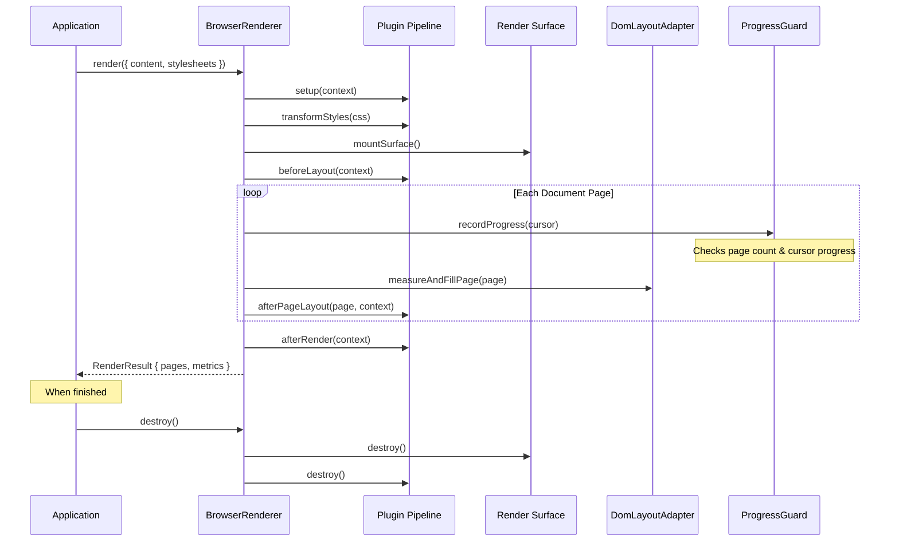

# Printedjs Architecture

Printedjs is a high-performance, modular TypeScript engine for browser-native paginated document rendering. It replaces legacy monolithic Paged.js with a multi-package architecture, strict separation of concerns, resilient loop protection, and comprehensive CSS Paged Media standards compliance.

---

## 1. Architectural Philosophy

Printedjs is built around four fundamental design tenets:

1. **Zero-DOM Core:** Pure layout logic, error handling, CSS AST analysis, and paginator state machines belong in a platform-agnostic core package with zero references to `window`, `document`, or browser CSSOM.
2. **Surface Isolation:** Rendered documents must never pollute host applications. Printedjs supports both in-place (`root`) and sandboxed (`iframe`) execution with guaranteed, residue-free teardown.
3. **Resilient Pagination Guard:** Documents with contradictory layout constraints or overflowing unbreakable blocks must never cause browser lockups or infinite render loops.
4. **Deterministic Plugin Pipeline:** Features such as margin boxes, running headers, footnotes, and counters are implemented as composable plugins with topological dependency resolution.

---

## 2. Monorepo Package Map

```
                              ┌────────────────────────┐
                              │    @printedjs/core     │  Zero DOM / CSSOM dependencies
                              │  Contracts, AST facade │  Pure paginator state machines
                              └───────────┬────────────┘
                                          │
        ┌─────────────────────────────────┼─────────────────────────────────┐
        ▼                                 ▼                                 ▼
┌───────────────────┐           ┌───────────────────┐             ┌───────────────────┐
│ @printedjs/browser│           │ @printedjs/plugins│             │@printedjs/devtools│
│  DOM layout adapter           │  Standard preset  │             │  Trace collector  │
│  Surface lifecycle│           │  Page rules & CSS │             │  Floating overlay │
│  Range measurement│           │  Footnotes & marks│             │  Non-layout layer │
└─────────┬─────────┘           └─────────┬─────────┘             └───────────────────┘
          │                               │
          ├───────────────────────────────┤
          │                               │
          ▼                               ▼
┌───────────────────┐           ┌───────────────────┐
│ @printedjs/minimal│           │@printedjs/polyfill│
│  All-in-one bundle│           │  Legacy browser   │
│  Auto-init preview│           │  DOM & observer   │
│  Compact footprint│           │  compatibility    │
└───────────────────┘           └───────────────────┘
          │
          ▼
┌───────────────────┐           ┌───────────────────┐
│  @printedjs/cli   │           │ apps/playground   │
│  Headless PDF CLI │           │ Interactive studio│
│  Dual driver (P/P)│           │ Live template HMR │
└───────────────────┘           └───────────────────┘
```

---

## 3. Package Responsibilities

### `@printedjs/core`

- **Zero DOM/CSSOM Policy:** Runs in Node.js, Deno, Bun, browser workers, and main threads without DOM APIs.
- **Typed Contracts:** Defines contracts for `RenderSession`, `RenderRequest`, `PageResult`, `PluginContext`, and error taxonomy.
- **CSS AST Facade:** AST parser based on `css-tree`, abstracting `@page` definitions, selectors, declarations, and margin box at-rules.
- **Paginator & Progress Guard:** State machine layout driver coupled with `LayoutProgressGuard` that enforces strict page, pass, and cursor advancement boundaries.

### `@printedjs/browser`

- **Surface Isolation:** Manages document containment in either `RootSurface` (isolated container inside host DOM) or `IframeSurface` (sandboxed iframe).
- **Measurement Engine:** Measures text nodes and block geometry using DOM Range APIs without destructive DOM reflows.
- **Content Splitting:** Handles complex table splits (repeating `thead`, `colgroup`, and rowspan continuations), fixed elements, and break propagations.
- **Deterministic Cleanup:** Surface destruction tears down observers, injected stylesheets, and container nodes without leaving orphaned DOM elements.

### `@printedjs/plugins`

- **Standard Preset (`standardPreset()`):** Composes standard Paged Media features in topological order:
  1. `pageRulesPlugin`: `@page` geometry, paper sizes, orientations, bleed, marks.
  2. `breaksPlugin`: `break-before`, `break-after`, `break-inside` (including legacy `page-break-*`).
  3. `stringsPlugin`: `string-set` extraction and running string lookups.
  4. `runningHeadersPlugin`: `position: running(...)` and `element(...)` header stamping.
  5. `generatedContentPlugin`: 16 CSS margin boxes (`@top-left`, `@bottom-right`, etc.) and margin tracks.
  6. `countersPlugin`: `counter(pages)`, `target-counter`, and cross-reference resolutions.
  7. `footnotesPlugin`: `float: footnote` extraction and page-bottom footnote placement.
  8. `columnsPlugin`: Multi-column flow (`column-count`, `column-gap`, `column-span: all`).
  9. `mathPlugin`: Formula overflow protection (`.katex-display`, `mjx-container`, `<math>`).
  10. `bookmarksPlugin`: PDF outline and document hierarchical navigation trees.
  11. `hyphenationPlugin`: Word-boundary and hyphenation preservation.
  12. `widowsOrphansPlugin`: Widow and orphan line constraints.

### `@printedjs/devtools`

- **Tracing:** Records phase timings, per-page render duration, and layout warnings.
- **Non-Layout Overlay:** Mounts floating inspector tools in a top-level z-index layer without altering document geometry.

### `@printedjs/polyfill`

- **Browser Compatibility:** Provides polyfills for legacy browser engines, including `ResizeObserver`, `IntersectionObserver`, and modern web standards.

### `@printedjs/minimal`

- **Drop-in Bundle:** Single, pre-bundled compact script (`printedjs.min.js`) containing the engine, standard plugins, polyfills, and automatic initialization on `DOMContentLoaded`.

### `@printedjs/cli`

- **Headless CLI:** Command-line tool (`printedjs render`) generating production PDFs using Playwright or Puppeteer with format and watch options.

---

## 4. Render Lifecycle Pipeline

The diagram below details the sequence of operations during a render invocation:



---

## 5. Loop Protection & Layout Resiliency

A common failure mode in legacy pagination engines is an unresolvable break constraint (for example, an unbreakable block taller than a page, or cyclical `break-before: avoid` rules) resulting in an infinite page generation loop that crashes the browser thread.

Printedjs prevents this through `LayoutProgressGuard`:

- **Cursor Tracking:** Records the break token and byte/DOM offset after each pass.
- **Zero-Progress Detection:** If a layout pass does not advance content through the document, the guard forces a break or truncates the overflow.
- **Limit Thresholds:** Configurable `maxPages` (default 500) and `maxPassesPerPage` limits raise a typed `PrintedjsLayoutLimitError` instead of freezing the browser.

---

## 6. Surface Isolation Modes

Printedjs offers two distinct rendering surfaces:

| Feature          | `RootSurface` (`isolation: "root"`)          | `IframeSurface` (`isolation: "iframe"`)      |
| :--------------- | :------------------------------------------- | :------------------------------------------- |
| **Container**    | Direct `<div>` inside host element           | Same-origin `<iframe>`                       |
| **Performance**  | Highest throughput; zero frame overhead      | Isolated browsing context                    |
| **CSS Scoping**  | Scoped via `.printedjs_pages` parent rules   | Completely isolated window & CSSOM           |
| **Print Output** | Native print stylesheets apply               | Frame content printed directly               |
| **Use Case**     | Single-page apps, playgrounds, fast previews | Untrusted user templates, enterprise portals |

---

## 7. DOM & CSS Conventions

- **Page Shell:** Each page box is structured with a root `.printedjs_page`, containing `.printedjs_sheet`, `.printedjs_pagebox`, and margin boxes (`.printedjs_margin-top-left`, etc.).
- **CSS Variables:** Dimensions, bleed, and margins are set on CSS custom properties (e.g., `--printedjs-width`, `--printedjs-height`, `--printedjs-margin-top`).
- **Compatibility Mode:** When `pagedjsCompatible: true` is configured, Printedjs emits both modern `.printedjs_*` classes and legacy `.pagedjs_*` classes, ensuring backward compatibility with existing print stylesheets.
